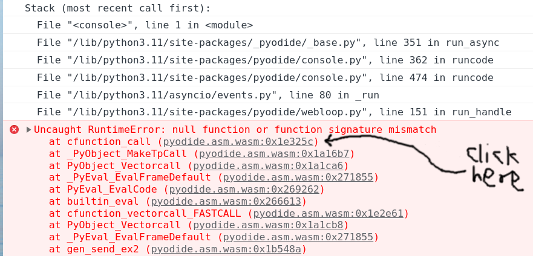
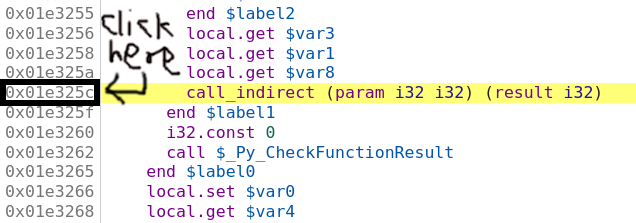
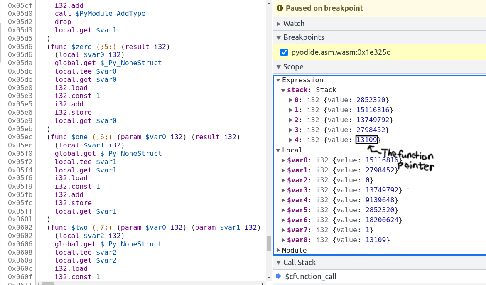
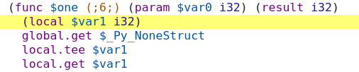

(debugging)=

# Debugging tips

See [Emscripten's page about
debugging](https://emscripten.org/docs/porting/Debugging.html) which has
extensive info about the various debugging options available. The [Wasm Binary
Toolkit](https://github.com/WebAssembly/wabt) is super helpful for analyzing
`.wasm`, `.so`, `.a`, and `.o` files.

Also whenever you can reproduce a bug in chromium make sure to use a
chromium-based browser (e.g., chrome) for debugging. They are better at it.

## Run `prettier` on `pyodide.asm.mjs`

Before doing any debugger I strongly recommend running
`npx prettier -w pyodide.asm.mjs`. This makes everything much easier.

(build-with-symbols)=

## Building with symbols or source maps

Building with symbols retains the names of all internal functions, but will not
prevent function calls from being inlined away and does not retain a source map
to the original C code. Symbols do not cause much of a slowdown and only cause a
minor increase in code size. Building with source maps disables many
optimizations such as inlining and slows down execution by quite a lot.

To rebuild with symbols you can use the following:

```sh
touch src/core/jsproxy.h
PYODIDE_SYMBOLS=1 make -C cpython rebuild-all
PYODIDE_SYMBOLS=1 make all-but-packages
```

To use source maps, use `PYODIDE_SOURCEMAPS=1` instead of `PYODIDE_SYMBOLS=1`.
To get the benefits of source maps, you need the
[C/C++ devtoools support Chrome extension](https://chromewebstore.google.com/detail/cc++-devtools-support-dwa/pdcpmagijalfljmkmjngeonclgbbannb?pli=1).

When source maps are present and the devtools extension is enabled, you will not
be able to see the raw disassembly, which makes it hard to inspect the state of
the program in the debugger because there is no support for executing C
expressions. The extension provides no way to see the raw assembly without
disabling the extension and refreshing the page.

(function-signature-mismatch)=

## Linker error: function signature mismatch

You may get linker errors as follows:

```
wasm-ld: error: function signature mismatch: some_func
>>> defined as (i32, i32) -> i32 in some_static_lib.a(a.o)
>>> defined as (i32) -> i32 in b.o
```

This is especially common in Scipy. Oftentimes it isn't too hard to figure out
what is going wrong because it told you the both the symbol name (`some_func`)
and the object files involved (this is much easier than the runtime version of
this error!). If you can't tell what is going on from looking at the source
files, it's time to pull out `wasm-objdump`. In this case `a.o` is part of
`some_static_lib.a` so you first need to get it out with
`ar -x some_static_lib.a a.o`.
Now we can check if `a.o` imports or defines `some_func`.
To check for imports, use `wasm-objdump a.o -j Import -x | grep some_func`.
If `a.o` is importing `some_func` you should see a line like:
`- func[0] sig=1 <env.some_func> <- env.some_func` in the output.

If not, you will see nothing or things like `some_func2`. To check if `a.o`
defines `some_func` (this is a bit redundant because you can conclude whether or
not does from whether it imports it) we can use:
`wasm-objdump a.o -j Function -x | grep some_func`, if
`a.o` defines `some_func` you will see something like:
` - func[0] sig=0 <some_func>`.

Now the question is what these signatures mean (though we already know this from
the linker error). To find out what signature 0 is, you can use
`wasm-objdump a.o -j Type -x | grep "type\[0\]"`.

Using this, we can verify that `a.o` imports `some_func` with signature
`(i32, i32) -> i32` but `b.o` exports it with signature `(i32) -> i32`,
hence the linker error.

This process works in basically the same way for already-linked `.so` and
`.wasm` files, which can help if you get the load-time version of this linker
error.

## Misencoded Wasm

On a very rare occasion you may run into a misencoded object file. This can
cause different tools to crash, `wasm-ld` may panic, etc. `wasm-objdump` will
just generate a useless error message. In this case, I recommend
`wasm-objdump -s --debug 2>&1 | grep -i error -C 20` (or pipe to `less`), which will result in
more diagnostic information. Sometimes the crash happens quite a lot later than the actual error,
look for suspiciously large constants, these are often the first sign of something gone haywire.

After this, you can get out a hex editor and consult the
[WebAssembly binary specification](https://webassembly.github.io/spec/core/binary/index.html)
Cross reference against the hex addresses appearing in `wasm-objdump --debug`.
With enough diligence you can locate the problem.

## Debugging RuntimeError: function signature mismatch

First recompile with a source map as suggested in {ref}`build-with-symbols`, and
disable the C/C++ DevTools extension (if it's enabled).

The browser console will show something like the following. Click on the
innermost stack trace:



Clicking the offset will (hopefully) take you to the corresponding wasm
instruction, which should be a `call_indirect`. If the offset is too large
(somewhere between `0x0200000` and `0x0300000`) you will instead see
`;; text is truncated due to size`, see {ref}`text-truncated-due-to-size`. In
this example we see the following:



So we think we are calling a function pointer with signature
`(param i32 i32) (result i32)`
meaning that it takes two `i32` inputs and returns one `i32` output. Set a
breakpoint by clicking on the address, then refresh the page and run the
reproduction again. Sometimes these are on really hot code paths (as in the
present example) so you probably only want to set the breakpoint once Pyodide is
finished loading. If your reproduction passes through the breakpoint multiple
times before crashing you can do the usual chore of counting how many times you
have to press "Resume" before the crash. Suppose you've done all this, and we've
got the vm stopped at the bad instruction just before crashing:



The bottom value on the stack is the function pointer. In this case it's the
fourth item on the stack, so you can type the following into the console:

```js
> pyodide._module.wasmTable.get(stack[4].value) // stack[4].value === 13109
< ƒ $one() { [native code] }
```

So the bad function pointer's symbol is `one`! Now clicking on `$one` brings you
to the source for it:



and we see the function pointer has signature `(param $var0 i32) (result i32)`,
meaning it takes one `i32` input and returns one `i32` output. Note that if the
function had `void` return type it might look like `(param $var0 i32 $var1 i32)`
(with no `result`). Confusion between `i32` and `void` return type is the single
most common cause of this error.

Now we basically know the cause of the trouble. You can look up `cfunction_call`
in the CPython source code with the help of ripgrep and locate the line that
generates this call, and look up `one` in the appropriate source and find the
signature. Another approach to locate the call site would be to recompile with
`-g3` and use source maps {ref}`build-with-symbols` to locate the problematic
source code. With the same process of reproduce crash ==> click innermost stack
frame ==> see source file and line where the error occurs. In this case we see
that the crash is on the line:

```C
result = _PyCFunction_TrampolineCall(meth, self, args);
```

in the file `/src/cpython/build/Python-3.11.0dev0/Objects/methodobject.c`.
Unfortunately, source maps are useless for the harder problem of finding the
callee because compiling with `-g3` increases the number of function pointers so
the function pointer we are calling is in a different spot. I know of no way to
determine the bad function pointer when compiling with `-g3`.

Sometimes (particularly with Scipy/OpenBLAS/libf2c) the issue will be a
mismatch between
`(param i32 i32 i32 i32 i32 i32 i32 i32 i32 i32 i32 i32 i32 i32) (result i32)` and
`(param i32 i32 i32 i32 i32 i32 i32 i32 i32 i32 i32 i32 i32 i32 i32) (result i32)`

(14 vs 15 parameters) which might be a little hard to discern. I copy the
signature into the Javascript console and run `"i32 ... i32".split(" ").length`
in this case.

(text-truncated-due-to-size)=

## Dealing with `;; text is truncated due to size`

If you are debugging and run into the dreaded `;; text is truncated due to size`
error message, the solution is to compile a modified version of Chrome devtools
with a larger wasm size cap. Surprisingly, this is not actually all that hard.

These instructions are adapted from here:
https://www.diverto.hr/en/blog/2020-08-15-WebAssembly-limit/

In short,

```
git clone https://chromium.googlesource.com/chromium/tools/depot_tools.git
./fetch devtools-frontend
cd devtools-frontend
```

Apply the following change:

```diff
--- a/front_end/entrypoints/wasmparser_worker/WasmParserWorker.ts
+++ b/front_end/entrypoints/wasmparser_worker/WasmParserWorker.ts
@@ -55,7 +55,7 @@ export function dissambleWASM(
     const lines = [];
     const offsets = [];
     const functionBodyOffsets = [];
-    const MAX_LINES = 1000 * 1000;
+    const MAX_LINES = 12 * 1000 * 1000;
     let chunkSize: number = 128 * 1024;
     let buffer: Uint8Array = new Uint8Array(chunkSize);
     let pendingSize = 0;
```

Then build with:

```
gn gen out/Default
autoninja -C out/Default
```

then

```
cd out/Default/resources/inspector_overlay/
python http.server <some_port>
```

and then you can start a version of chrome using the modified devtools:

```
chrome --custom-devtools-frontend=http://localhost:<some_port>/
```
